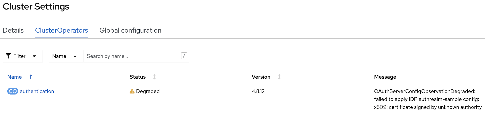
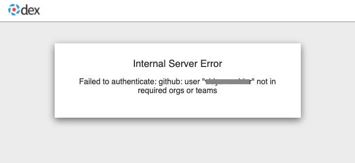
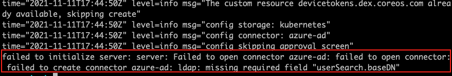
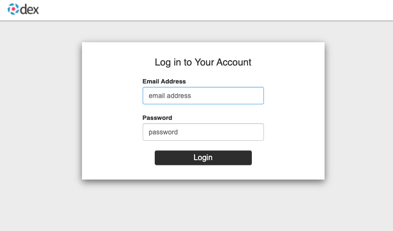
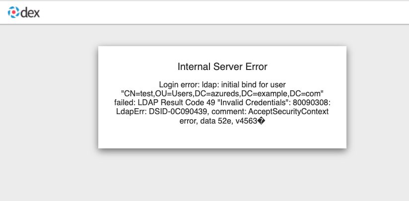
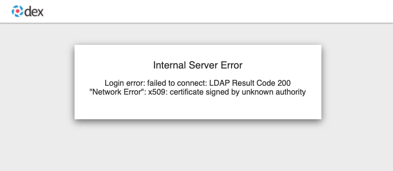

[#troubleshooting]
= Troubleshooting

[#installer-crash-loop-back-off]
== The installer pod CrashLoopBackOff

You launched the IDP installation from the OperatorHub and the installation failed. A reason could be that Red Hat Advanced Cluster Management or Multicluster Engine is not installed.

* Check the installer log
+
[source,terminal]
----
oc logs -l control-plane=controller-manager -n <idp-installation-namespace> 
----
A message similar to the following means the prerequisite are not met.
+
[source,terminal]
----
2022-01-10T14:17:21.962Z	ERROR	setup	unable to create controller	{"controller": "Installer", "error": "IDP prerequisites are not met: neither Red Hat Advanced Cluster Management or Multicluster Engine installation has been detected, the product Red Hat Advanced Cluster Management is not installed on this cluster\nthe product Multicluster Engine is not installed on this cluster", "errorVerbose": "neither Red Hat Advanced Cluster Management or Multicluster Engine installation has been detected, the product Red Hat Advanced Cluster Management is not installed on this cluster\nthe product Multicluster Engine is not installed on this cluster\nIDP prerequisites are not met"}
----

[#Error-on-operator-page]
== Error appears on operator page after installing through OperatorHub 

After instaling "identity configuration management", the "operator page" shows a 404 error.

* Check the installer log
+
[source,terminal]
----
oc logs -l control-plane=controller-manager -n <idp-installation-namespace>
----
A message similar to the following means a preview installation wasn't correctly cleaned.
+
[source,terminal]
----
2022-01-23T23:32:57.111Z	ERROR	controller.idpconfig	Reconciler error	{"reconciler group": "identityconfig.identitatem.io", "reconciler kind": "IDPConfig", "name": "idp-config", "namespace": "idp-mgmt-config", "error": "\"idp-mgmt-operator/leader_election_role_binding.yaml\" (string): RoleBinding.rbac.authorization.k8s.io \"idp-mgmt-operator-leader-election-rolebinding\" is invalid: roleRef: Invalid value: rbac.RoleRef{APIGroup:\"rbac.authorization.k8s.io\", Kind:\"Role\", Name:\"leader-election-operator-role\"}: cannot change roleRef", "errorVerbose": "\"idp-mgmt-operator/leader_election_role_binding.yaml\" (string): RoleBinding.rbac.authorization.k8s.io \"idp-mgmt-operator-leader-election-rolebinding\" is invalid: roleRef: Invalid value: rbac.RoleRef{APIGroup:\"rbac.authorization.k8s.io\", Kind:\"Role\", Name:\"leader-election-operator-role\"}: cannot change roleRef\ngithub.com/identitatem/idp-mgmt-operator/controllers/installer.(*IDPConfigReconciler).processIDPConfigCreation\n\t/remote-source/app/controllers/installer/installer_controller.go:168\ngithub.com/identitatem/idp-mgmt-operator/controllers/installer.(*IDPConfigReconciler).Reconcile\n\t/remote-source/app/controllers/installer/installer_controller.go:126\nsigs.k8s.io/controller-runtime/pkg/internal/controller.(*Controller).reconcileHandler\n\t/remote-source/deps/gomod/pkg/mod/sigs.k8s.io/controller-runtime@v0.9.7/pkg/internal/controller/controller.go:298\nsigs.k8s.io/controller-runtime/pkg/internal/controller.(*Controller).processNextWorkItem\n\t/remote-source/deps/gomod/pkg/mod/sigs.k8s.io/controller-runtime@v0.9.7/pkg/internal/controller/controller.go:253\nsigs.k8s.io/controller-runtime/pkg/internal/controller.(*Controller).Start.func2.2\n\t/remote-source/deps/gomod/pkg/mod/sigs.k8s.io/controller-runtime@v0.9.7/pkg/internal/controller/controller.go:214\nruntime.goexit\n\t/usr/lib/golang/src/runtime/asm_amd64.s:1581"}
----

* Clean the RoleBinding
+
[source,terminal]
----
oc delete rolebinding idp-mgmt-operator-leader-election-rolebinding -n <idp-installation-namespace>
----
+
Once the deletion done, reinstall the "identity configuration management" again.

[#login-button-missing]
== New login option specified in AuthRealm is not appearing on the managed cluster

You've created your AuthRealm and updated your managed cluster as appropriate such that it should match the Placement, but the new login option is not appearing on your managed cluster. Follow the steps below to determine the issue.

. Wait several minutes. It takes time for the OpenShift authentication pods to restart and reflect the new configuration.
. If the button does not appear after several minutes, run the following on the managed cluster to confirm the cluster OAuth configuration was propagated correctly from the hub: `oc get oauth cluster -oyaml` You should see an identity provider with a name matching your AuthRealm name and an issuer URL that reflects your hub cluster URL and routeSubDomain. If you do, continue to the next step. If not, check the following on the hub cluster: 
* Check the AuthRealm
+
[source,terminal]
----
oc get authrealm <AuthRealm name> -n <AuthRealm namespace> -o yaml
----
And verify the status.condition.type:Applied has a status of **"True"**.  If the status is false, check the reason and message.
Note: Applied **"True"** just mean the AuthRealm was successfully processed by the controller and subsequent resources are created; it doesn't mean the managed cluster authentication system is successfully updated.

* Check for a ManifestWork named **idp-oauth** in the managed cluster namespace.  
+
[source,terminal]
----
oc get manifestworks idp-oauth -n <managed cluster namespace> -o yaml
----
And verify the status.condition.type:Applied has a status of **"True"**.  If the status is false, wait a minute or two and recheck.  If the ManifestWork does not exist, check the following on the hub cluster: 

* Check the PlacementDecision in the AuthRealm namespace to be sure the managed cluster was properly selected as part of the Placement and ManagedClusterSet.
+
[source,terminal]
----
oc get placementdecision -n <AuthRealm namespace> -o yaml
----
Check the status.decision list contains an entry for the managed cluster.  If not, verify the Placement, ManagedClusterSet and ManagedClusterSetBindings are properly configured to include the managed cluster.

. From the OpenShift Container Platform console UI on the managed cluster, navigate to Administration->Cluster Settings->ClusterOperators. Check the Status of the `authentication` operator, and if it is not showing green Available, check the Message for an indication of the error.

[#openshift-auth-error]
== OpenShift authentication is failing with "An authentication error has occurred"

The new login option is showing up on your managed cluster, but when you try to complete the authentication flow, it ends with an error from OpenShift that says "An authentication error has occurred". Follow the steps below to determine the issue.

. Check the logs of the authentication operator by running the following on the managed cluster:
+
[source,terminal]
----
oc get pods -n openshift-authentication
oc logs <pod_name>
----
+
. If no errors are found, you may need to enable debug mode in the authentication operator:
+
[source,terminal]
----
$ oc edit authentication.operator.openshift.io
  ...
  spec:
    logLevel: Debug  <-- change from Normal to Debug
  managementState: Managed
----
+
. Wait for the openshift-authentication pods to restart and then check the logs again:
+
[source,terminal]
----
watch oc get pods -n openshift-authentication
oc logs <pod_name>
----
+

Collisions with existing users and identities on the managed cluster can cause the "An authentication error has occurred" message. Consider whether your selected https://docs.openshift.com/container-platform/4.8/authentication/understanding-identity-provider.html#identity-provider-parameters_understanding-identity-provider[mapping method] in your AuthRealm is right for your situation. Also remember that when you delete a user from a managed cluster, you will also need to delete the identity for that user in order for that user to be created correctly again on future login attempts with a new identity provider:
+
[source,terminal]
----
oc get identity
oc delete <identity_name>
----
+

[#application-not-available]
== OpenShift authentication is failing with "Application is not available"

Reaching the "Application is not available" 503 error page after clicking on the OpenShift login button can be an indication of a number of problems. Following are troubleshooting steps you can try.

[#github-callback-url]
=== Check your GitHub OAuth app callback URL

If you are using GitHub as your identity provider, and are able to successfully authenticate to GitHub, but your OpenShift login then ends with an "Application is not available" message, it is likely that you have an incorrect callback URL specified in your GitHub OAuth application. Review the callback URL in the browser address bar and confirm that it is your route subdomain specified in your AuthRealm (or the `host` if you are using a custom certificate).

[#troubleshoot-dex-server]
=== Check if the OpenID Connect proxy server is running correctly

The OpenID Connect proxy server runs in the namespace `idp-mgmt-<AuthRealm.routeSubDomain>`. A DexServer custom resource is used by identity configuration management to configure and track this proxy server. From the `idp-mgmt-<AuthRealm.routeSubDomain>` OpenShift project on your hub cluster, run the following:
[source,terminal]
----
$ oc get dexserver dex-server -ojson | jq -r '.status.conditions'
[
  {
    "lastTransitionTime": "2021-11-04T20:30:35Z",
    "message": "DexServer is applied",
    "reason": "Applied",
    "status": "True",
    "type": "Applied"
  },
  {
    "lastTransitionTime": "2021-11-05T12:03:19Z",
    "message": "DexServer deployment is available",
    "reason": "Available",
    "status": "True",
    "type": "Available"
  }
]

----

Confirm no issues are reported. The type "Applied" indicates that the DexServer custom resource was successfully processed by the controller, and all related resources have been synchronized. The type "Available" reflects the status of the Dex server deploment pods.

Assuming your DexServer deployment is healthy, next check the ingress. Again from the `idp-mgmt-<AuthRealm.routeSubDomain>` OpenShift project on your hub cluster, run the following:
[source,terminal]
----
$ oc get ingress dex-server
NAME         CLASS    HOSTS                                     ADDRESS                              PORTS     AGE
dex-server   <none>   yourRouteSubDomain.apps.clusterurl.com    router-default.apps.clusterurl.com   80, 443   17h
----

An empty ADDRESS column is an indication that your ingress has a problem. One possible issue if you are using a custom certificate is that your certificate secret was not set up correctly in the `idp-mgmt-<AuthRealm.routeSubDomain` namespace. Run `oc get secrets` and confirm you see an entry with the name you specified in `AuthRealm.certificatesSecretRef.name` and that it is of type `kubernetes.io/tls`.

If the ingress is not found, an error message should be present in the DexServer custom resource status.

[#invalid-client-id]
== OpenShift authentication fails with "Bad Request" "Invalid client_id"

If after you press the OpenShift login button, you see a page displaying "Bad Request" and "Invalid client_id", there is an issue with the configuration for this managed cluster on the hub cluster.

On the hub cluster, look for the dex client that should have been created under the covers for this managed cluster. Run the following on the hub cluster, substituting your value for routeSubDomain:
[source,terminal]
----
$ oc get dexclients -n idp-mgmt-<routeSubDomain>
NAME                                   AGE
<managed_cluster>-<authrealm>          7m18s
----
You should see an entry for your managed cluster. If so, check the status to confirm the DexClient custom resource was successfully applied and an oauth2client was created on the Dex server.
[source,terminal]
----
$ oc get dexclient  <managed_cluster>-<authrealm> -n idp-mgmt-<routeSubDomain> -ojson | jq -r '.status.conditions'
[
  {
    "lastTransitionTime": "2021-11-11T14:54:48Z",
    "message": "Dex client is created",
    "reason": "Created",
    "status": "True",
    "type": "Applied"
  },
  {
    "lastTransitionTime": "2021-11-11T14:54:48Z",
    "message": "oauth2client is created",
    "reason": "Created",
    "status": "True",
    "type": "OAuth2ClientCreated"
  }
]
----
You should see a status of "True" for both conditions. If not, review the errors. The type "Applied" indicates whether the controller has successfully processed the DexClient custom resource. The type "OAuth2ClientCreated" indicates whether an oauth2client was created on the Dex server for the managed cluster.

If you do not see a dex client for your managed cluster, check the operator logs for errors by running the following on the hub cluster:
[source,terminal]
----
$ oc logs -l control-plane=idp-mgmt-operator-manager -n idp-mgmt-config
----

[#github-failures]
== Github login failure

=== User is not a member of the GitHub organization specified in the AuthRealm

If the AuthRealm custom resource specifies one or more values in the `github.organizations` field, the user attempting login to the cluster via GitHub will be authenticated against the specified organization(s). If the user is not a member of at least one of the organizations specified in the AuthRealm, they will not be able to login. The error will appear as follows:

* Check that the user attempting login is a member of at least one of the GitHub organizations specified in the AuthRealm. 
* If the GitHub OAuth application is not owned by an organization specified in `github.organizations`, an organization owner must grant third-party access to use this option. 

=== Internal Server Error: missing access_token

If after you press the OpenShift login button, you see a page displaying "Internal Server Error" and "Failed to authenticate: github: failed to get token: oauth2: server response missing access_token", you likely have an invalid GitHub OAuth client id and secret in your AuthRealm. Review your AuthRealm CR `spec.identityProviders.github.clientSecret` and `spec.identityProviders.github.clientSecret` fields, and ensure the base64-encoded client secret referenced in `spec.identityProviders.github.clientSecret` is correct by running the following:
[source,terminal]
----
$ oc get secret <your_secret_name> -n <your_authrealm_namespace> -ojson | jq -r '.data.clientSecret' | base64 -d
----
You can match the trailing 8 characters of the base64-decoded secret with the Client secrets listed on your GitHub OAuth page. GitHub also indicates when the secret was last used, which can be a clue as to whether your client secret has been applied successfully. 

[#ldap-failures]
== LDAP related issues

=== Issues with setting up the OpenID Connect proxy server correctly with the LDAP connector

If you do not see the new login option even after several minutes, it is possible that the OpenID Connect proxy server is not deployed correctly as it is unable to set up the LDAP connector based on the information provided in the AuthRealm CR. For instance, not specifying `ldapExtraConfigs.<idp-name>.baseDN` in the AuthRealm CR or missing to create the secret containing the `bindPassword` can prevent the OpenID Connect proxy server from being deployed correctly.

. Refer to the <<troubleshoot-dex-server, step above>> to view the status information in the DexServer custom resource.

. Check the logs of the dex server pod by running the following on the hub cluster, substituting your value for `routeSubDomain`:

Fetch logs from the pod for more information on the error:
----
$ oc logs -l control-plane=dex-server -n idp-mgmt-<routeSubDomain>
----

*Example:*

=== LDAP login failures

The new login option is showing up on your managed cluster, but when you try to complete the authentication flow via the <<ldap-login-ui,LDAP login UI>>, it ends with an error.

[#ldap-login-ui]

==== Examples of errors that could occur during this flow:

* Incorrect bind credentials used to authenticate with the LDAP server
** Check that the correct bindDN and bindPassword was provided for the LDAP identity provider in the AuthRealm CR.
+

* Incorrect certificate for the LDAP server
** Check that the correct certificate was provided in the secret that is referenced in the `ca` field  for the ldap identity provider in the AuthRealm CR.
+

